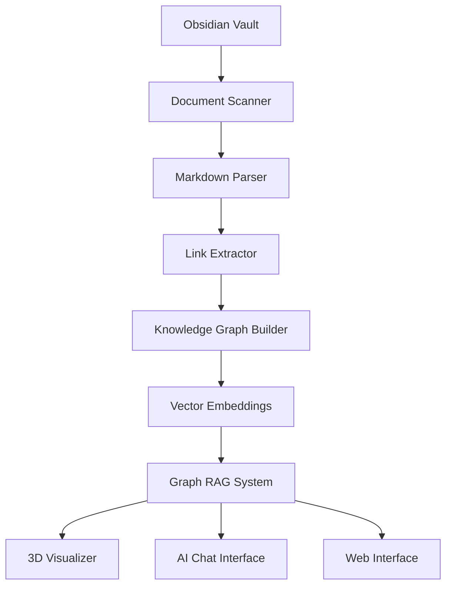

# 🧠 Obsidian Graph RAG: Complete System Overview

**Transform your Obsidian vault into an intelligent, interactive knowledge exploration system.**

## 🌟 What Is This?

This is a **Graph RAG (Retrieval Augmented Generation)** system specifically designed for Obsidian vaults. It combines:

- 🕸️ **Knowledge Graphs** - Maps the connections between your notes
- 🔍 **Vector Search** - Finds semantically similar content  
- 🤖 **AI Chat** - Answers questions about your knowledge
- 🌐 **3D Visualization** - Interactive exploration of your note connections

**In Simple Terms:** It reads all your Obsidian notes, understands how they connect, and gives you powerful ways to explore and query your knowledge - either by chatting with an AI that knows your notes, or by exploring a 3D interactive map of your ideas.

## 🧠 How It Works (The Big Picture)

### The Graph RAG Concept
Traditional RAG (Retrieval Augmented Generation) only uses vector similarity to find relevant documents. **Graph RAG** is smarter - it combines:

1. **Semantic Search**: "Find notes similar to this topic"
2. **Graph Traversal**: "Also include notes connected to those notes"
3. **AI Generation**: "Answer the question using this richer context"

### Your Obsidian Vault → Knowledge Graph

```
Your Notes:          Knowledge Graph:           AI Understanding:
┌─────────────┐     ┌─────────────────────┐    ┌─────────────────┐
│ Note A      │────▶│     A ←→ B ←→ C     │───▶│ "I can answer   │
│ [[Note B]]  │     │     ↕    ↕    ↕     │    │  questions      │
└─────────────┘     │     D ←→ E ←→ F     │    │  about your     │
┌─────────────┐     │     ↕    ↕    ↕     │    │  knowledge!"    │
│ Note B      │────▶│     G ←→ H ←→ I     │    └─────────────────┘
│ [[Note C]]  │     └─────────────────────┘
└─────────────┘
```

## 🏗️ System Architecture

### 🔄 The Complete Workflow



### 📋 Phase-by-Phase Breakdown

1. **📁 Document Scanning**
   - Scans your Obsidian vault for `.md` files
   - Respects `.obsidian` folder exclusions
   - Tracks file changes for incremental updates

2. **📝 Document Processing** 
   - Parses markdown content
   - Extracts frontmatter, titles, tags
   - Identifies document metadata

3. **🔗 Link Extraction**
   - Finds `[[wikilinks]]` between notes
   - Maps `![[embeds]]` and `#tags`
   - Builds relationship network

4. **🕸️ Knowledge Graph Construction**
   - Creates network graph (nodes = documents, edges = links)
   - Calculates connection weights
   - Identifies communities/clusters

5. **🔍 Vector Embedding Generation**
   - Generates OpenAI embeddings for semantic search
   - Caches embeddings for performance
   - Enables "similarity" queries

6. **🧠 Graph RAG Retrieval**
   - Combines vector search + graph traversal
   - Finds relevant documents via multiple pathways
   - Provides rich context for AI responses

7. **🎮 User Interfaces**
   - Interactive 3D visualization
   - Conversational AI chat
   - Web browser interface

## 📁 File Organization & Architecture

### 🎯 **Core System** (The Engine)
```
graphrag.py                 # 🏗️ Main system engine - all core classes and logic
├── ObsidianGraphRAG       # Central orchestrator
├── VaultScanner           # Scans for markdown files
├── MarkdownParser         # Parses .md files 
├── LinkExtractor          # Finds [[wikilinks]]
├── EmbeddingManager       # Handles vector embeddings
├── GraphRAGRetriever      # Combines graph + vector search
└── ObsidianChatBot        # AI chat interface
```

### 🚀 **Interface Layer** (How You Use It)
```
graph3d_launcher.py        # 🎛️ MAIN LAUNCHER - unified interface
├── 3D Visualization       # Interactive graph exploration
├── AI Chat               # Question answering
├── Combined Interface    # Both features together
└── Custom Settings       # Advanced configuration

start_chat.py             # 💬 Simple AI chat interface
web_chat.py              # 🌐 Web browser interface
simple_chat.py           # ⚡ Minimal chat implementation
```

### 🔧 **Utilities & Tools**
```
plotly_graph_visualizer.py # 🎨 3D visualization engine (Plotly-based)
graph_visualizer.py        # 📊 Basic visualization system
check_system.py           # 🔍 Diagnostic & troubleshooting tool
load_and_chat.py          # ⚡ Quick loader for cached data
test_*.py                 # 🧪 Testing scripts
```

### ⚙️ **Configuration**
```
example.env               # 📋 Configuration template
requirements.txt          # 📦 Python dependencies  
requirements_viz.txt      # 🎨 Visualization dependencies
.gitignore               # 🔒 Protects personal data
```

### 💾 **Generated/Cache** (Created automatically)
```
cache/                   # 🗄️ Processed data storage
├── processed_data/      # Documents, graph, embeddings
├── documents.pkl        # Your parsed notes
├── knowledge_graph.gpickle  # The connection network
└── embeddings.pkl       # Vector representations

logs/                    # 📝 System logs
*.html                   # 🌐 Generated 3D visualizations
```

## 🚀 Quick Start Guide

### 1️⃣ **Setup (One-Time)**

```bash
# Clone the repository
git clone <your-repo-url>
cd obsidian-graph-rag

# Install dependencies
pip install -r requirements.txt

# Configure your system
cp example.env .env
# Edit .env with your settings:
#   OBSIDIAN_VAULT_PATH=C:\path\to\your\vault
#   OPENAI_API_KEY=sk-your-key-here
```

### 2️⃣ **First Run (System Learning)**

```bash
python graph3d_launcher.py
```

**What happens:**
- 📁 Scans your entire Obsidian vault
- 🔗 Maps all connections between notes
- 🧠 Generates AI embeddings (requires OpenAI API)
- 💾 Caches everything for faster future runs
- ⏱️ Takes 2-10 minutes depending on vault size

### 3️⃣ **Daily Usage (Instant Access)**

```bash
python graph3d_launcher.py
```

**Choose Your Interface:**
- **Option 1**: 🌐 3D Graph Visualizer (explore connections visually)
- **Option 2**: 🤖 AI Librarian Chat (ask questions about your notes) 
- **Option 3**: 🔧 Both interfaces (start with 3D, then chat)
- **Option 4**: 🎨 Custom 3D settings (different layouts)

## 🎮 Interface Options Explained

### 🌐 **3D Graph Visualizer**
**What it does:** Interactive 3D map of your knowledge
```
🎮 Controls:
- Mouse: Rotate and navigate
- Scroll: Zoom in/out
- Click nodes: View note details
- Hover: See connections
- Dropdown: Change layout algorithms
```

**Perfect for:**
- 👀 Visual exploration of your knowledge
- 🔍 Finding unexpected connections
- 🗺️ Understanding knowledge structure
- 💡 Discovering related topics

### 🤖 **AI Chat Interface**
**What it does:** Natural language Q&A with your notes
```
💬 Example Conversations:
You: "What did I write about machine learning?"
AI: "Based on your notes, you have extensive content on..."

You: "How does meditation relate to productivity?"  
AI: "Your notes show several connections..."

You: "Summarize my thoughts on creativity"
AI: "Across your creativity-related notes, key themes include..."
```

**Perfect for:**
- ❓ Answering specific questions
- 📚 Research and synthesis  
- 🧠 Rediscovering forgotten insights
- 📝 Preparing content from your notes

### 🌐 **Web Interface**
**What it does:** Browser-based access
```bash
python web_chat.py
# Opens in your browser at http://localhost:5000
```

**Perfect for:**
- 💻 Better typing experience
- 📱 Mobile access
- 🔗 Sharing with others (local network)
- 📊 Rich formatting in responses

## 🔧 Advanced Features

### ⚡ **Intelligent Caching**
- 💾 **Incremental Updates**: Only processes changed files
- 🚀 **Fast Startup**: Subsequent runs start in seconds
- 🔄 **Auto-Detection**: Knows when to rebuild vs. load cache
- 💡 **Smart Upgrades**: Migrates cache format when needed

### 🔍 **System Diagnostics**
```bash
python check_system.py
# Comprehensive system health check
# Identifies and fixes common issues
# Provides detailed troubleshooting guidance
```

### 🎨 **Visualization Layouts**
- **Spring 3D**: Physics-based natural clustering
- **Circular 3D**: Multi-layer circular arrangement  
- **Spherical 3D**: Notes distributed on sphere surface
- **Hierarchical 3D**: Vertical layers by importance
- **Community Layers**: Separate Z-layers for topic clusters

### ⚙️ **Customization Options**
```bash
# Environment variables for fine-tuning:
TOP_K_VECTOR=10        # How many similar docs to find
TOP_K_GRAPH=5          # How many connected docs to include  
MAX_TOKENS=2000        # Response length limit
TEMPERATURE=0.1        # AI creativity level
```

## 🛠️ Troubleshooting

### ❌ **Common Issues & Solutions**

**"No vault path specified"**
```bash
# Set environment variable:
export OBSIDIAN_VAULT_PATH="/path/to/your/vault"
# Or edit .env file
```

**"API key required"**  
```bash
# Get OpenAI API key from: https://platform.openai.com/api-keys
# Set environment variable:
export OPENAI_API_KEY="sk-your-key-here"
```

**"Cache corruption errors"**
```bash
python check_system.py --fix-issues
# Auto-detects and fixes cache problems
```

**"System running slowly"**
```bash
# Check system status:
python check_system.py

# Force cache rebuild:
rm -rf cache/
python graph3d_launcher.py
```

### 🔍 **Diagnostic Tools**
```bash
# Comprehensive system check:
python check_system.py

# Test specific components:
python test_chatbot.py          # Test AI chat
python test_3d_visualization.py # Test 3D features

# Quick cache loading test:
python load_and_chat.py
```

## 📚 Example Use Cases

### 🎓 **Academic Research**
```
Scenario: Literature review on "attention mechanisms"
1. Ask: "What did I note about attention in machine learning?"
2. 3D view: Explore connected papers and concepts
3. Follow-up: "How does this relate to transformer architecture?"
```

### 💼 **Knowledge Work**
```
Scenario: Preparing presentation on company strategy  
1. Ask: "Summarize my notes on competitive analysis"
2. 3D view: See connections between market research notes
3. Export: Generate outline from retrieved information
```

### 📖 **Personal Knowledge Management**
```
Scenario: Connecting ideas across different domains
1. 3D view: Discover unexpected connections between topics
2. Ask: "How do my philosophy notes relate to productivity?"
3. Insight: Find novel synthesis opportunities
```

### 🔬 **Research & Writing**
```
Scenario: Writing article about creativity
1. Ask: "What are my key insights about creative processes?"
2. 3D view: Explore related concepts and examples
3. Chat: "Help me organize these ideas into an outline"
```

## 🌟 Why This Approach Works

### 🧠 **Cognitive Alignment**
- **Mirrors Human Thinking**: Follows associative thought patterns
- **Preserves Context**: Maintains relationships between ideas
- **Enables Serendipity**: Discovers unexpected connections

### 🔗 **Leverages Obsidian's Strengths**
- **Uses Existing Links**: Your `[[wikilinks]]` become graph edges
- **Respects Your Structure**: Works with your organization system
- **Enhances Rather Than Replaces**: Augments your existing workflow

### 🚀 **Combines Best of Both Worlds**
- **Vector Search**: Finds semantically similar content
- **Graph Traversal**: Includes explicitly connected context
- **AI Generation**: Synthesizes information naturally

---

## 🎯 **Quick Reference**

**Main Command:** `python graph3d_launcher.py`

**Key Files:**
- `graphrag.py` - Core system
- `graph3d_launcher.py` - Main interface
- `check_system.py` - Diagnostics
- `.env` - Your configuration

**Interfaces:**
- 3D Visualization - Visual exploration
- AI Chat - Question answering  
- Web Interface - Browser access

**First Time:** Takes 2-10 minutes to process vault
**Regular Use:** Starts in seconds with cached data

---

*Transform your static notes into a dynamic, intelligent knowledge system that grows with your thinking.* 